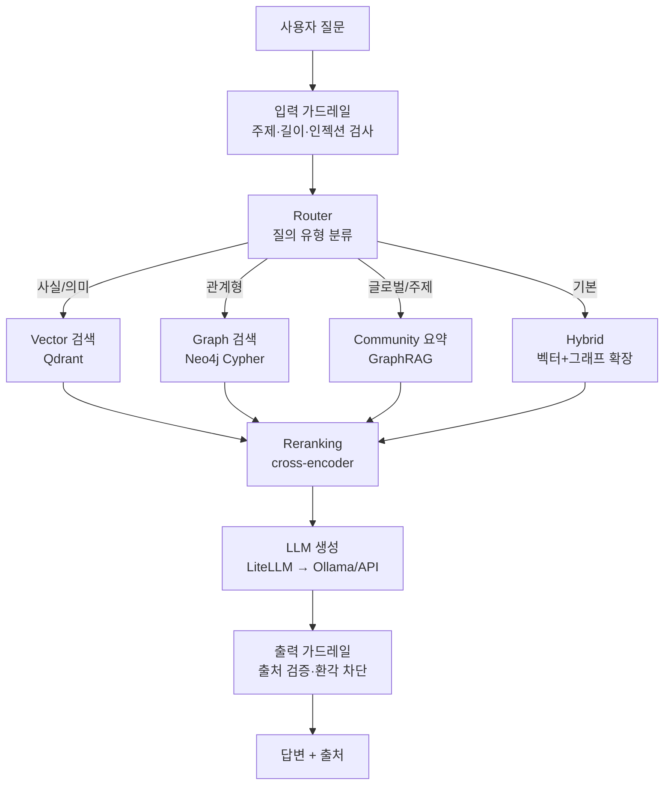
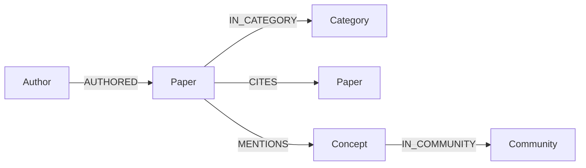

# arXiv Hybrid RAG — 설계 문서

Vector 검색과 Graph 검색을 결합해 arXiv AI 논문 코퍼스에 대한 질의응답을 수행하는 시스템. VectorDB(Qdrant)는 의미 검색, GraphDB(Neo4j)는 인용·저자·개념 관계 검색을 담당하며, LiteLLM 추상화로 로컬(Ollama)·클라우드 LLM을 무중단 스왑한다.

마지막 업데이트: 2026-06-30

---

## 1. 목표

단일 벡터 RAG가 약한 **관계형·글로벌 질의**를 Vector + Graph 하이브리드로 해결한다.

- 관계형 질의(인용·저자·카테고리)를 그래프 경로로 정확히 응답
- 글로벌/주제 질의를 GraphRAG 커뮤니티 요약으로 응답
- 단계별 RAGAS 지표로 하이브리드의 정량 개선을 측정

## 2. 완료 조건 (Sprint Contract)

각 Phase는 측정 가능한 완료 조건을 만족해야 다음으로 넘어간다. "잘 된다"가 아니라 숫자로 판정한다.

### Phase 1 — Vector RAG (MVP)
- arXiv `cs.CL` + `cs.AI` 논문 **≥ 10,000편**을 Qdrant에 인덱싱
- 질문 입력 시 top-k 검색 → 출처(arxiv_id) 포함 답변 생성
- 기본 가드레일: 주제 이탈 거부, 출처 인용 강제, 코퍼스에 없는 논문 ID 환각 차단
- **판정**: `make demo`가 샘플 질문 5개에 출처 포함 답변 / smoke 테스트 통과

### Phase 2 — Graph 하이브리드
- Neo4j에 `Paper / Author / Category` 노드 + `AUTHORED / IN_CATEGORY / CITES` 엣지 적재 (CITES는 Semantic Scholar 보강)
- 라우터가 질의를 `vector / graph / hybrid`로 분류
- 벡터 단독으로는 못 푸는 관계형 질의를 그래프로 해결한 **문서화된 사례 ≥ 3개**
- **판정**: "graph wins" 사례 3건 재현 / 하이브리드 경로가 융합 컨텍스트 반환

### Phase 3 — 논문 적용 + 평가
- GraphRAG 방식 개념 추출 + 커뮤니티 요약 (글로벌 질의 대응)
- cross-encoder reranking 추가
- **50문항 평가셋**에 RAGAS 적용 → vector / hybrid / +graphrag / +rerank 단계별 before-after 표
- **판정**: README에 정량 평가표 게재 / `make eval` 재현 가능

## 3. 아키텍처



질의 유형별 검색 경로:

| 질의 유형 | 예시 | 경로 |
|---|---|---|
| 사실/의미 | "transformer의 attention이란?" | Vector |
| 관계형 | "BERT를 인용한 논문 중 2024년 발표는?" | Graph (Cypher) |
| 글로벌/주제 | "RAG 분야는 어떻게 발전해왔나?" | GraphRAG 커뮤니티 요약 |
| 복합(기본) | "GraphRAG 관련 최신 연구와 핵심 저자는?" | Hybrid (벡터 검색 → 그래프 확장 → 융합) |

## 4. 데이터 모델

### 4.1 데이터 소스
- **Kaggle arXiv 데이터셋** (`Cornell-University/arxiv`): 메타데이터 JSONL. 필드 = `id, title, authors, abstract, categories, journal-ref, doi, update_date, versions`. **인용 정보 없음.**
- **Semantic Scholar Academic Graph API**: `arxivId`로 매칭하여 `references / citations` 보강. 무료, 키 없이 기본 사용 가능(rate limit 존재 → 캐싱·배치 필수).

코퍼스 범위: 전체 1.7M편은 과도 → **`cs.CL` + `cs.AI`, 2022–2025** 서브셋으로 한정(수만 편 규모). GraphRAG 개념층은 비용 때문에 더 작은 서브셋(예: 2,000편)으로 제한.

### 4.2 Vector 스키마 (Qdrant collection `papers`)
- vector: `bge-m3` 1024-dim, 임베딩 대상 = `title + abstract`
- payload: `arxiv_id, title, authors[], primary_category, categories[], year, abstract, doi, journal_ref`
- payload 인덱스: `primary_category`, `year` → 정형 필터링용

### 4.3 Graph 스키마 (Neo4j)



| 노드 | 속성 | 비고 |
|---|---|---|
| `Paper` | arxiv_id, title, year, primary_category | |
| `Author` | name | |
| `Category` | code | cs.CL 등 |
| `Concept` | name, description | Phase 3, LLM 추출 |
| `Community` | id, level, summary | Phase 3, Leiden + LLM 요약 |

엣지: `AUTHORED`, `IN_CATEGORY`, `CITES`(Semantic Scholar), `MENTIONS`(Phase 3), `IN_COMMUNITY`(Phase 3).

메타데이터·인용 그래프(1층)는 결정적 변환이라 GPU가 필요 없다. 개념·커뮤니티 그래프(2층)는 LLM 추출이라 GPU가 필요하다.

## 5. 기술 스택 결정

| 레이어 | 선택 | 근거 |
|---|---|---|
| LLM 서빙 | **LiteLLM** 게이트웨이 + Ollama(`qwen2.5:7b-instruct`) | 단일 인터페이스로 로컬↔API 무중단 스왑 → 배포 유연성 |
| 임베딩 | **bge-m3** (1024-dim) | 멀티링궐·하이브리드 검색 강점, 소비자 GPU 적재 가능. 경량 대안: `nomic-embed-text`(768-dim) |
| VectorDB | **Qdrant** (Docker) | 페이로드 필터링 강력 → 정형 메타 필터 + 의미 검색 결합 |
| GraphDB | **Neo4j Community** (Docker) | Cypher 표현력, GraphRAG 레퍼런스 풍부 |
| Reranking | cross-encoder (`bge-reranker` 등) | Phase 3 고도화 + ablation 대상 |
| 평가 | **RAGAS** (faithfulness, answer relevancy, context precision, context recall) | RAG 표준 메트릭, LLM-judge는 API로 수행 가능 |
| API/UI | FastAPI + 경량 프론트 | 데모용 엔드포인트 |

## 6. 가드레일 설계

- **입력**: 주제 범위 검사(CS/AI 논문 질의인가), 프롬프트 인젝션·과길이 차단
- **출력**: 모든 주장에 `arxiv_id` 출처 강제 / 검색 점수 낮으면 추상(abstention) / 코퍼스에 실재하는 ID인지 검증해 환각 차단
- **PII**: arXiv 저자명은 공개 메타데이터지만 별도 저장·노출 최소화. 질의·로그에 PII 저장 금지.

## 7. 논문 적용 지점 (고도화)

| 기법 | 적용 위치 | 측정 |
|---|---|---|
| HyDE (가상 답변 임베딩) | 검색 전 질의 확장 | recall 변화 |
| GraphRAG (커뮤니티 요약) | 글로벌 질의 경로 | 글로벌 질의 답변 품질 |
| Cross-encoder reranking | 검색 후 재정렬 | context precision 변화 |

각 기법은 적용 전후를 RAGAS로 정량 비교하여 README에 표로 게재한다.

## 8. 평가 계획

- 50문항 평가셋 구성: 사실형 / 관계형 / 글로벌형 균형
- 단계별 측정: `vector` → `+hybrid` → `+graphrag` → `+rerank`
- 산출: 4개 메트릭 × 4개 구성의 비교표 + "graph wins" 정성 사례
- 재현성: `make eval`로 일괄 실행

## 9. 레포 구조

```
arxiv-hybrid-rag/
├── README.md                 # 아키텍처·평가표·데모
├── DESIGN.md                 # 본 문서
├── docker-compose.yml        # qdrant + neo4j
├── .env.example              # LLM 프로바이더 스왑 (api ↔ ollama)
├── requirements.txt
├── Makefile                  # ingest / index / graph / demo / eval
├── data/                     # raw 덤프 (gitignore)
├── src/
│   ├── config.py
│   ├── llm.py                # LiteLLM 래퍼 (프로바이더 무관)
│   ├── ingest/
│   │   ├── arxiv_loader.py   # Kaggle JSONL 파싱·서브셋
│   │   └── citations.py      # Semantic Scholar 인용 보강
│   ├── index/
│   │   ├── embed.py
│   │   └── qdrant_store.py
│   ├── graph/
│   │   ├── neo4j_store.py
│   │   └── graphrag.py       # Phase 3 개념 추출 + 커뮤니티
│   ├── retrieve/
│   │   ├── router.py
│   │   ├── vector_search.py
│   │   ├── graph_search.py
│   │   ├── hybrid.py
│   │   └── rerank.py
│   ├── guardrails/
│   ├── generate/
│   └── api/                  # FastAPI + 경량 UI
├── eval/
│   ├── testset.jsonl
│   └── run_ragas.py
└── notebooks/
```

## 10. 단계별 로드맵

| Phase | 작업 | GPU |
|---|---|---|
| 0 | 레포 스캐폴딩, docker-compose, LiteLLM 설정, 데이터 로더 | 불필요 |
| 1 | Vector RAG MVP (Qdrant 인덱싱·검색·생성·가드레일) | 생성 단계만 |
| 2 | 메타·인용 그래프(Neo4j) + 라우터 + 하이브리드 융합 | 불필요 |
| 3 | GraphRAG 개념층 + reranking + RAGAS 평가 | 필요 |

LiteLLM 추상화로 생성 백엔드를 로컬(Ollama)·클라우드 API 간 설정만으로 교체할 수 있어, GPU가 없는 환경에서도 파이프라인을 개발·검증할 수 있다.

## 11. 리스크와 완화

| 리스크 | 완화 |
|---|---|
| Semantic Scholar rate limit | 배치 + 디스크 캐시 + 인용 깊이 1로 제한, 필요 시 API 키 |
| 소비자 GPU(≈8GB VRAM) 메모리 제약 | 7B 양자화(Q4_K_M), bge-m3 적재 확인, GraphRAG는 소규모 서브셋 |
| 전체 코퍼스 과대 | cs.CL+cs.AI / 2022–2025 서브셋으로 한정 |
| 로컬 LLM 검증 비용 | LiteLLM로 개발 단계는 API 백엔드, 로컬 서빙은 별도 검증 단계로 분리 |
