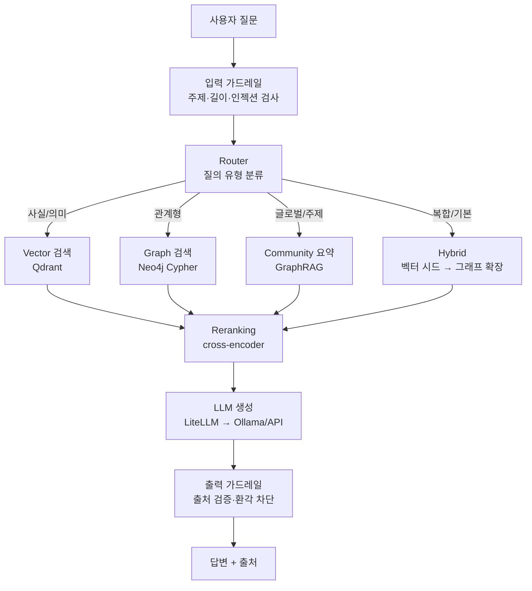

# arxiv-hybrid-rag

arXiv AI 논문 코퍼스에 대한 **하이브리드 RAG(Retrieval-Augmented Generation)** 시스템.
Vector 검색(Qdrant)과 Graph 검색(Neo4j)을 질의 유형에 따라 라우팅·융합해, 단일 벡터 RAG가 약한 **관계형·글로벌 질의**까지 답한다.

> 🚧 **상태: 개발 중** — Phase 0(설계·스캐폴딩) 완료, Phase 1 구현 진행. 단계별 진행은 [로드맵](#로드맵) 참고. 설계 의사결정은 [DESIGN.md](DESIGN.md) 참고.

---

## 목차

- [개요](#개요)
- [시스템 아키텍처](#시스템-아키텍처)
- [프로젝트 구조](#프로젝트-구조)
- [기술 스택](#기술-스택)
- [핵심 기술 소개](#핵심-기술-소개)
- [데이터](#데이터)
- [사전 요구사항](#사전-요구사항)
- [빠른 시작](#빠른-시작)
- [평가](#평가)
- [로드맵](#로드맵)

---

## 개요

벡터 RAG는 의미가 비슷한 문단을 잘 찾지만, 다음과 같은 질의에는 약하다.

- **관계형 질의** — "이 논문을 인용한 후속 연구는?", "두 저자를 잇는 공동 연구는?"
- **글로벌 질의** — "이 분야는 어떻게 발전해왔나?", "주요 연구 흐름은?"

이 프로젝트는 의미 검색(Vector)과 관계 검색(Graph)을 질의 유형에 따라 라우팅하고 결과를 융합해 이 간극을 메운다. LLM 서빙은 LiteLLM으로 추상화해 로컬(Ollama)과 클라우드 API를 설정만으로 교체한다.

---

## 시스템 아키텍처



### 질의 유형별 검색 경로

| 질의 유형 | 예시 | 경로 | 담당 |
|---|---|---|---|
| 사실/의미 | "transformer의 attention이란?" | Vector | Qdrant |
| 관계형 | "BERT를 인용한 2024년 논문은?" | Graph | Neo4j Cypher |
| 글로벌/주제 | "RAG 분야는 어떻게 발전해왔나?" | GraphRAG | 커뮤니티 요약 |
| 복합(기본) | "GraphRAG 최신 연구와 핵심 저자는?" | Hybrid | 벡터 시드 → 그래프 확장 → 융합 |

<details>
<summary><strong>그래프 2층 구조</strong></summary>

| 층 | 내용 | 노드/엣지 | LLM |
|---|---|---|---|
| 1층 — 메타·인용 | 결정적 변환 | `Paper / Author / Category`, `AUTHORED / IN_CATEGORY / CITES` | 불필요 |
| 2층 — 개념·커뮤니티 | GraphRAG | `Concept / Community`, `MENTIONS / IN_COMMUNITY` | 추출·요약에 필요 |

1층은 Kaggle 메타데이터 + Semantic Scholar 인용으로 구축하고, 2층은 초록에서 LLM으로 개념을 추출한 뒤 Leiden 커뮤니티 탐지·요약으로 구축한다.
</details>

<details>
<summary><strong>가드레일</strong></summary>

| 단계 | 검사 |
|---|---|
| 입력 | 주제 범위(CS/AI 논문 질의), 프롬프트 인젝션, 과길이 차단 |
| 출력 | 모든 주장에 `arxiv_id` 출처 강제, 낮은 검색 점수 시 추상(abstention), 코퍼스 미존재 ID 환각 차단 |
</details>

---

## 프로젝트 구조

```
arxiv-hybrid-rag/
├── docker-compose.yml        # Qdrant + Neo4j
├── requirements.txt
├── Makefile                  # up / ingest / index / graph / demo / eval
├── .env.example              # LLM 프로바이더 스왑 (ollama ↔ api)
├── src/
│   ├── config.py             # 환경 변수 설정 (pydantic-settings)
│   ├── llm.py                # LiteLLM 래퍼 (생성/임베딩, 프로바이더 무관)
│   ├── models.py             # 공용 타입 (Paper, RetrievedDoc)
│   ├── ingest/
│   │   ├── arxiv_loader.py   # Kaggle JSONL 파싱·서브셋
│   │   └── citations.py      # Semantic Scholar 인용 보강
│   ├── index/
│   │   ├── embed.py          # 배치 임베딩
│   │   └── qdrant_store.py   # 컬렉션 생성·인덱싱
│   ├── graph/
│   │   ├── neo4j_store.py    # 메타·인용 그래프
│   │   └── graphrag.py       # 개념 추출 + 커뮤니티 요약
│   ├── retrieve/
│   │   ├── router.py         # 질의 유형 분류
│   │   ├── vector_search.py  # 벡터 검색
│   │   ├── graph_search.py   # Cypher 관계 검색
│   │   ├── hybrid.py         # 벡터 시드 → 그래프 확장 융합
│   │   └── rerank.py         # cross-encoder 재정렬
│   ├── guardrails/checks.py  # 입출력 가드레일
│   ├── generate/answer.py    # 컨텍스트 기반 답변 생성
│   └── api/demo.py           # CLI 데모 (파이프라인 오케스트레이션)
├── eval/
│   ├── testset.jsonl         # 평가셋 (사실/관계/글로벌)
│   └── run_ragas.py          # RAGAS 평가
├── data/                     # raw 덤프 (gitignore)
└── notebooks/
```

---

## 기술 스택

| 레이어 | 선택 | 역할 |
|---|---|---|
| LLM 서빙 | LiteLLM + Ollama (`qwen2.5:7b-instruct`) | 로컬↔API 무중단 스왑 |
| 임베딩 | `bge-m3` (1024-dim) | 의미 벡터 생성 (경량 대안 `nomic-embed-text`) |
| VectorDB | Qdrant | 의미 검색 + 정형 메타 필터링 |
| GraphDB | Neo4j Community | 인용·저자·개념 관계 (Cypher) |
| 커뮤니티 탐지 | Leiden (`leidenalg`) | GraphRAG 계층 클러스터링 |
| Reranking | cross-encoder (`bge-reranker`) | 검색 결과 재정렬 |
| 평가 | RAGAS | faithfulness, answer relevancy, context precision/recall |
| API/UI | FastAPI | 데모 엔드포인트 |

---

## 핵심 기술 소개

이 프로젝트에서 사용하는 주요 기술의 간략한 설명과 공식 문서.

<details>
<summary><strong>RAG</strong> — Retrieval-Augmented Generation</summary>

외부 지식을 검색해 LLM 생성에 주입하는 기법. 모델 파라미터에 없는 최신·도메인 지식을 근거와 함께 답하게 하고, 환각을 줄인다.

> - [RAG 원 논문 (Lewis et al., 2020)](https://arxiv.org/abs/2005.11401)
</details>

<details>
<summary><strong>Hybrid RAG / GraphRAG</strong> — 그래프 결합 검색</summary>

벡터 검색에 그래프 검색을 결합한다. GraphRAG는 문서에서 LLM으로 엔티티·관계를 추출해 지식 그래프를 만들고, 커뮤니티 탐지·요약으로 "글로벌 질의"에 답한다.

- **엔티티/관계 추출**: LLM이 텍스트에서 노드·엣지를 추출
- **커뮤니티 탐지**: Leiden 알고리즘으로 계층 클러스터링
- **커뮤니티 요약**: 클러스터별 요약으로 주제 질의 대응

> - [Microsoft GraphRAG](https://github.com/microsoft/graphrag)
> - [HyDE (가상 답변 임베딩)](https://arxiv.org/abs/2212.10496)
</details>

<details>
<summary><strong>Qdrant</strong> — 벡터 데이터베이스</summary>

임베딩 벡터의 유사도 검색을 담당. payload 필터링이 강력해 의미 검색과 정형 메타(카테고리·연도) 필터를 함께 적용할 수 있다.

> - [Qdrant 공식 문서](https://qdrant.tech/documentation/)
</details>

<details>
<summary><strong>Neo4j</strong> — 그래프 데이터베이스</summary>

논문·저자·개념을 노드로, 인용·저작·언급을 엣지로 저장. Cypher 쿼리로 "인용한 논문", "저자 간 경로" 같은 관계형 질의에 답한다.

> - [Neo4j 공식 문서](https://neo4j.com/docs/)
> - [Cypher 쿼리 언어](https://neo4j.com/docs/cypher-manual/current/)
</details>

<details>
<summary><strong>LiteLLM</strong> — LLM 게이트웨이</summary>

100여 개 LLM 프로바이더를 단일 인터페이스로 호출. `.env`의 모델명만 바꾸면 로컬 Ollama와 클라우드 API(OpenAI/Anthropic 등)를 코드 수정 없이 교체한다.

> - [LiteLLM 공식 문서](https://docs.litellm.ai/)
> - [Ollama](https://ollama.com/)
</details>

<details>
<summary><strong>bge-m3</strong> — 임베딩 모델</summary>

BAAI의 멀티링궐 임베딩 모델(1024-dim). dense/sparse/multi-vector 검색을 함께 지원해 하이브리드 검색에 강하다.

> - [bge-m3 (Hugging Face)](https://huggingface.co/BAAI/bge-m3)
</details>

<details>
<summary><strong>RAGAS</strong> — RAG 평가 프레임워크</summary>

RAG 시스템을 정량 평가한다. 핵심 메트릭:

- **faithfulness** — 답변이 검색 컨텍스트에 사실적으로 부합하는가
- **answer relevancy** — 답변이 질문에 부합하는가
- **context precision / recall** — 검색이 관련 문서를 잘/충분히 가져왔는가

> - [RAGAS 공식 문서](https://docs.ragas.io/)
</details>

---

## 데이터

| 소스 | 내용 | 용도 |
|---|---|---|
| [Kaggle arXiv 데이터셋](https://www.kaggle.com/datasets/Cornell-University/arxiv) | 메타데이터 JSONL (제목·저자·초록·카테고리) | 벡터 인덱싱, 메타 그래프 |
| [Semantic Scholar API](https://api.semanticscholar.org/) | `arxivId` 매칭 인용/피인용 | 인용 엣지(CITES) 보강 |

코퍼스 범위: `cs.CL` + `cs.AI`, 2022–2025 서브셋. GraphRAG 개념층은 비용상 더 작은 서브셋에만 적용.

---

## 사전 요구사항

| 도구 | 버전 | 비고 |
|---|---|---|
| Python | 3.11+ | |
| Docker / Docker Compose | 20.10+ | Qdrant, Neo4j 실행 |
| Ollama | 최신 | 로컬 LLM 서빙 (API 백엔드 사용 시 생략 가능) |
| GPU | VRAM 8GB+ 권장 | 로컬 7B 모델·임베딩. 없으면 LiteLLM로 API 백엔드 사용 |

---

## 빠른 시작

```bash
# 1. 클론
git clone https://github.com/km8026/arxiv-hybrid-rag.git
cd arxiv-hybrid-rag

# 2. 의존성 설치
pip install -r requirements.txt   # 또는: make install

# 3. 환경 변수
cp .env.example .env
# .env 편집 — 로컬: LLM_MODEL=ollama/...  |  API: LLM_MODEL=openai/... + 키 입력

# 4. 벡터/그래프 DB 기동
make up        # docker compose up -d (Qdrant :6333, Neo4j :7474/:7687)

# 5. (로컬 서빙 시) 모델 준비
ollama pull qwen2.5:7b-instruct
ollama pull bge-m3
```

파이프라인 실행:

```bash
make ingest    # arXiv 메타데이터 로드·서브셋
make index     # 임베딩 + Qdrant 인덱싱
make graph     # Neo4j 메타·인용 그래프 구축
make demo      # CLI 질의응답 데모
```

> 각 파이프라인 단계는 로드맵의 Phase 순서대로 구현된다. 현재 기동(`make up`)·환경 설정은 동작하며, 데이터 파이프라인은 Phase 1부터 채워진다.

---

## 평가

Phase 3에서 50문항 평가셋(사실/관계/글로벌)에 RAGAS를 적용해 구성별 비교표를 게재한다.

| 구성 | faithfulness | answer relevancy | context precision | context recall |
|---|---|---|---|---|
| vector | — | — | — | — |
| + hybrid | — | — | — | — |
| + graphrag | — | — | — | — |
| + rerank | — | — | — | — |

벡터 단독으로 실패하고 하이브리드로 해결되는 "graph wins" 정성 사례도 함께 정리한다.

---

## 로드맵

- [x] **Phase 0** — 설계([DESIGN.md](DESIGN.md)), 레포 스캐폴딩
- [ ] **Phase 1** — Vector RAG MVP (Qdrant 인덱싱·검색·생성·가드레일)
- [ ] **Phase 2** — 메타·인용 Graph(Neo4j) + 라우터 + 하이브리드 융합
- [ ] **Phase 3** — GraphRAG 개념층 + reranking + RAGAS 평가
