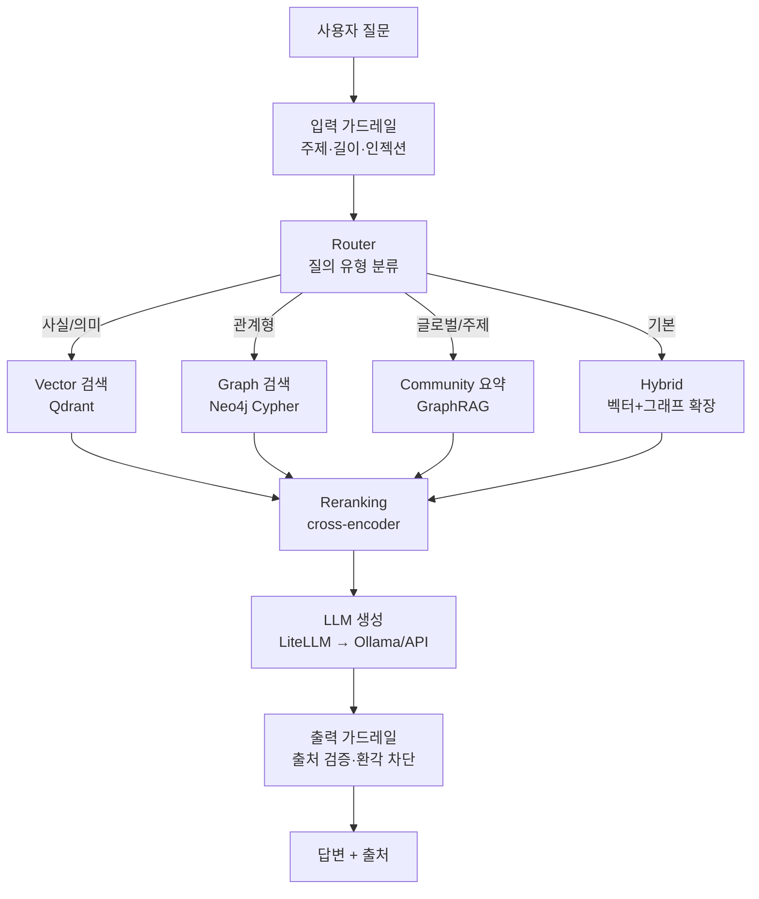

# arxiv-hybrid-rag

> arXiv AI 논문 코퍼스에 대한 **하이브리드 RAG** — Vector 검색(Qdrant)과 Graph 검색(Neo4j)을 결합해, 단일 벡터 RAG가 약한 **관계형·글로벌 질의**까지 답한다.

🚧 **상태: 개발 중** — 설계 완료, Phase 1 구현 진행. 정량 평가표는 Phase 3에서 채워진다. 진행 현황은 아래 [로드맵](#로드맵) 참고.

## 무엇을 푸는가

벡터 RAG는 의미가 비슷한 문단을 잘 찾지만, "이 논문을 인용한 후속 연구는?", "이 분야는 어떻게 발전했나?" 같은 **관계형·글로벌 질의**에 약하다. 이 프로젝트는 의미 검색(Vector)과 관계 검색(Graph)을 질의 유형에 따라 라우팅·융합해 이 간극을 메운다.

## 아키텍처

질의 유형별 검색 경로:

| 질의 유형 | 예시 | 경로 |
|---|---|---|
| 사실/의미 | "transformer의 attention이란?" | Vector |
| 관계형 | "BERT를 인용한 2024년 논문은?" | Graph (Cypher) |
| 글로벌/주제 | "RAG 분야는 어떻게 발전해왔나?" | GraphRAG 커뮤니티 요약 |
| 복합(기본) | "GraphRAG 최신 연구와 핵심 저자는?" | Hybrid (벡터→그래프 확장→융합) |

## 기술 스택

| 레이어 | 선택 | 비고 |
|---|---|---|
| LLM 서빙 | LiteLLM + Ollama (`qwen2.5:7b-instruct`) | 로컬↔API 무중단 스왑 |
| 임베딩 | `bge-m3` (1024-dim) | 멀티링궐, 경량 대안 `nomic-embed-text` |
| VectorDB | Qdrant | 페이로드 필터링(정형 메타) + 의미 검색 |
| GraphDB | Neo4j Community | 인용·저자·개념 관계 (Cypher) |
| Reranking | cross-encoder (`bge-reranker`) | 검색 후 재정렬 |
| 평가 | RAGAS | faithfulness, answer relevancy, context precision/recall |

## 데이터

- **Kaggle arXiv 데이터셋** (`Cornell-University/arxiv`) — 메타데이터(제목·저자·초록·카테고리). 범위: `cs.CL + cs.AI`, 2022–2025 서브셋.
- **Semantic Scholar API** — `arxivId` 매칭으로 인용/피인용 엣지 보강.

## 결과 (Results)

> Phase 3 평가 완료 후 RAGAS 단계별 비교표(vector → hybrid → +graphrag → +rerank)와 "graph wins" 정성 사례가 여기 채워진다.

## 로드맵

- [x] **Phase 0** — 설계([DESIGN.md](DESIGN.md)), 레포 스캐폴딩
- [ ] **Phase 1** — Vector RAG MVP (Qdrant 인덱싱·검색·생성·가드레일)
- [ ] **Phase 2** — 메타·인용 Graph(Neo4j) + 라우터 + 하이브리드 융합
- [ ] **Phase 3** — GraphRAG 개념층 + reranking + RAGAS 평가

## 빠른 시작

> Phase 1 구현 후 `docker-compose up` + `make demo` 절차로 채워진다.

## 설계 판단 (Why)

아키텍처 선택 근거, 트레이드오프, 측정 가능한 완료 조건은 [DESIGN.md](DESIGN.md)에 정리되어 있다.
